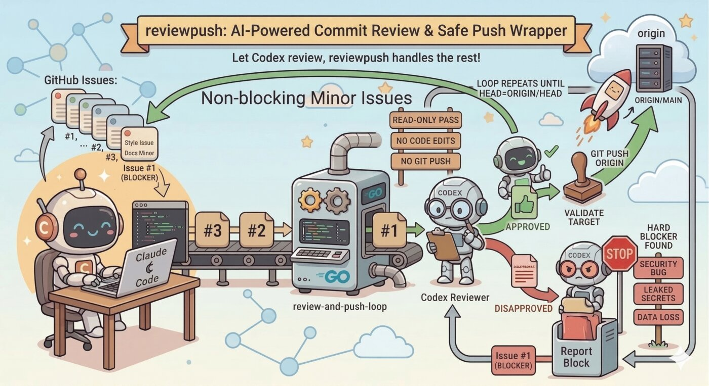

# reviewpush

`reviewpush` is the library and CLI wrapper behind `review-and-push-loop`.

It is built for a very specific workflow: let Codex review commits, but do not let Codex edit code or push directly. The wrapper keeps the review pass read-only, validates the result, and performs the push itself.

> "I finally found the proper usage of codex! Review but don't work on the code. It shows its super power when I tell it that the code is written by Claude Code!"



## What it does

`review-and-push-loop` repeatedly:

1. Fetches `origin`.
2. Detects the remote base branch from `origin/HEAD`, or falls back to `main`, `master`, or `trunk`.
3. Finds the oldest local commit that is ahead of the remote base branch.
4. Starts a fresh Codex process to review that commit.
5. Lets Codex choose one of two outcomes:
   - `PUSH`: push exactly that commit, or push through a descendant commit to batch contiguous commits.
   - `BLOCKED`: stop because a hard blocker was found.
6. Validates the proposed push target before pushing.
7. Repeats until `HEAD` is no longer ahead of the remote base branch.

The Codex pass is explicitly instructed to stay read-only and inspect Git objects directly. The wrapper, not Codex, performs `git push`.

## Workflow diagram

Typical usage looks like this:

```text
Claude Code writes commits locally

  main
    |
    o  origin/main
    |
    o  C1  "Claude change 1"
    |
    o  C2  "Claude change 2"
    |
    o  C3  "Claude change 3"   <- HEAD

Queue seen by review-and-push-loop:

  oldest ----------------------------------------------> newest
  [ C1 ] -> [ C2 ] -> [ C3 ]

Loop:

  +------------------------+
  | review-and-push-loop   |
  +------------------------+
            |
            v
    pick oldest ahead commit
            |
            v
  +------------------------+
  | Codex review pass      |
  | read-only              |
  | no code edits          |
  | no git push            |
  +------------------------+
        |            |
   PUSH |            | BLOCKED
        v            v
  validate target    stop the loop
  git push origin
  origin/main moves forward
        |
        v
  queue shrinks:
  [ C2 ] -> [ C3 ]
        |
        v
  repeat until empty
```

With non-blocking findings, the intended human workflow is often:

```text
Codex review
   |
   +--> hard blocker found
   |      -> stop push
   |
   +--> non-blocking concern
          -> push commit anyway
          -> optionally spin off a GitHub issue for follow-up
```

The GitHub issue step is not automated by `review-and-push-loop` itself. The tool only decides whether to push or stop, then performs the validated push.

## Review policy

The prompt is intentionally narrow. It treats only hard blockers as push-stopping issues, such as:

- security bugs
- leaked secrets
- obvious destructive data loss or corruption
- clearly broken startup or primary-path behavior

Non-blocking feedback is expected to stay non-blocking. This tool is for landing reviewed commits one at a time, not for asking Codex to rewrite the branch.

## Safety properties

Before pushing, the wrapper checks that the proposed `push_target`:

- resolves to a real commit
- is a descendant of the remote base ref
- is at or after the oldest commit currently under review
- is an ancestor of `HEAD`

That prevents Codex from pushing an unrelated commit or skipping outside the contiguous range between the oldest unpushed commit and `HEAD`.

There is also a cross-check for multi-commit pushes:

- if `multi_commits=false`, the wrapper pushes only the current target commit, even if `push_target` names a later commit
- if `multi_commits=true`, the wrapper allows pushing through the validated descendant commit

## CLI

Install:

```bash
go install github.com/jaeyeom/experimental/devtools/reviewpush/cmd/review-and-push-loop@latest
```

Run from a repository:

```bash
review-and-push-loop
```

Run against another repo:

```bash
review-and-push-loop --repo /path/to/repo
```

Override base branch detection:

```bash
review-and-push-loop --base main
```

Limit the loop:

```bash
review-and-push-loop --max-iterations 10
```

If you build with Bazel, the binary target is `//devtools/reviewpush/cmd/review-and-push-loop`.

## Flags

- `--repo`: repository directory, default `.`
- `--base`: override automatic base branch detection
- `--max-iterations`: maximum number of review/push cycles, default `100`

## Environment variables

- `GIT_BIN`: git executable, default `git`
- `CODEX_BIN`: codex executable, default `codex`
- `CODEX_TIMEOUT_SECONDS`: per-pass timeout, default `300`

## Exit codes

- `0`: success, `HEAD` is no longer ahead of the remote base branch
- `1`: configuration error
- `2`: blocked, push failed, Codex failed, or the loop hit a guardrail

## Codex response contract

Each Codex pass must return JSON matching this shape:

```json
{
  "status": "PUSH",
  "summary": "brief explanation",
  "multi_commits": false,
  "push_target": "abc123",
  "blocked_reason": null
}
```

Or, when blocked:

```json
{
  "status": "BLOCKED",
  "summary": "hard blocker found",
  "multi_commits": false,
  "push_target": null,
  "blocked_reason": "security bug"
}
```

## Notes

- The tool tolerates a dirty working tree and tells Codex to ignore unrelated local changes unless they directly affect the review.
- It prints a commit banner using `git log --stat --format=fuller -1 <commit>` before each pass so the target is obvious.
- It probes `codex exec --help` and only uses flags supported by the installed Codex binary, such as `--ask-for-approval`, `--sandbox`, `--ephemeral`, `--output-schema`, and `--output-last-message`.
